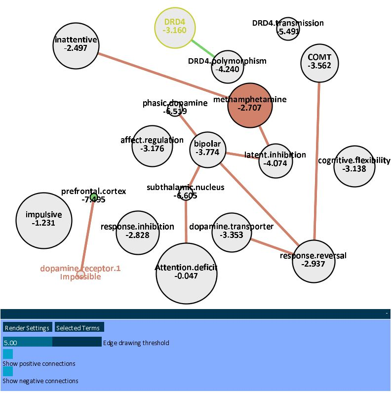

# vissen

Prototype of a tool for visualizing term co-occurrences in PubMed abstracts, written for the [UCLA CNP](http://www.phenomics.ucla.edu/). Uses [Processing 1.5 (Java)](https://processing.org) for graphical display, and the inference library from [SamIam](http://reasoning.cs.ucla.edu/samiam/), developed by UCLA's [Automated Reasoning Group](http://reasoning.cs.ucla.edu/). No longer under development.

Run the demo by opening "index.html" under the "applet" directory in a browser with the Java plugin enabled, or by launching "sensitivity_demo.jar" directly from the console.

## Controls
* w, s, a, d: Pan up, down, left, or right
* +/-: Zoom in/out
* e: Toggle edge drawing
* r: Toggle physics (currently unstable)
* n: Reset network to initial configuration
* Middle-click + drag: Pan view
* Mouse scroll: Zoom view
* Right-click + drag up: Condition on node under mouse being true
* Right-click + drag down: Condition on node under mouse being false
* Left-click: Select node or begin box selection if not over a node. Hold control to toggle selection, shift to always add.
* Left-click + drag: Move selected nodes.

## Notes
Numbers displayed on nodes are the log-odds of that term conditioned on the terms marked by the user. Nodes conditioned as true have green backgrounds, as false have red. Edges correspond to sensitivity values (defined as log-odds before conditioning minus log-odds after conditioning); red edges correspond to negative sensitivity, green to positive. Red edges represent negative partial correlations between terms, green positive partial correlations under the current conditioning.
